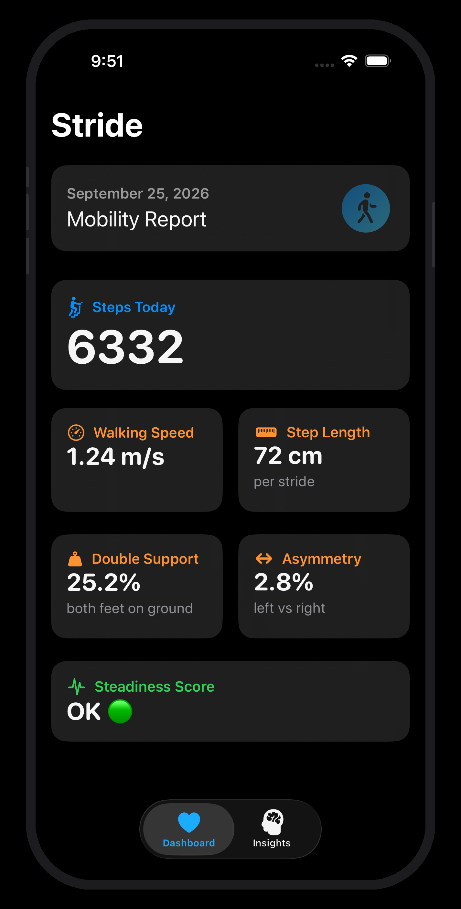
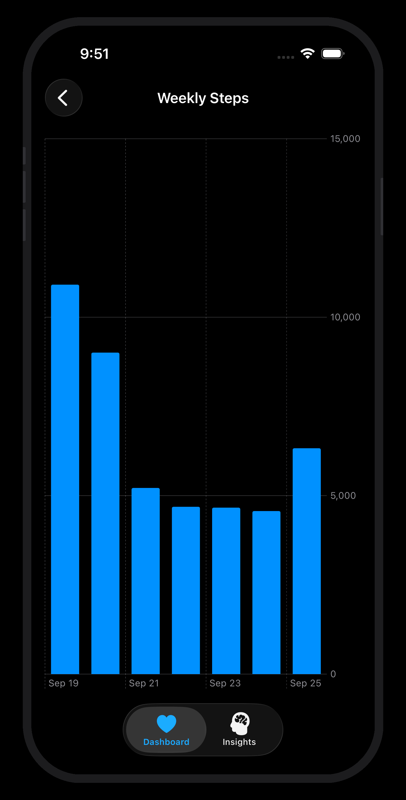
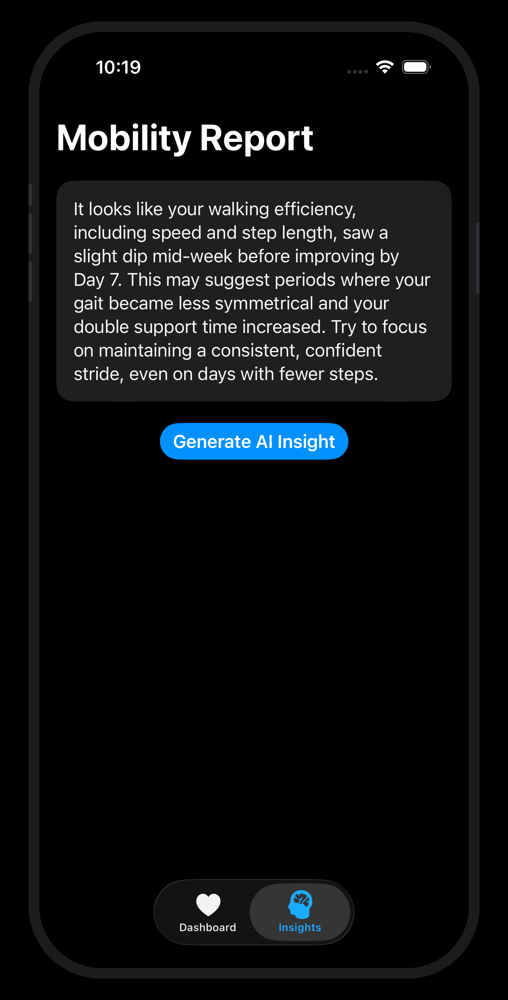

# Stride

An iOS app for tracking mobility and health insights via HealthKit.

## Screenshots

<p align="center">
  
  
  
</p>

## Features

Stride pulls walking metrics from Apple HealthKit — steps, walking speed, step length, gait asymmetry — and turns them into a weekly mobility dashboard. Trends are visualized with Swift Charts, and Google Gemini writes short, plain-language insights based on the last 7 days of activity.

## Built with

- Swift 5 · SwiftUI · MVVM
- Apple HealthKit
- Swift Charts
- async/await concurrency
- Google Gemini API

## Setup

**Requirements**
- Xcode 26 · iOS 26.2+ target
- A [Google AI Studio API key](https://aistudio.google.com/apikey) for the Gemini integration
- A device with HealthKit data (or add sample data in the simulator's Health app)

**Steps**
1. Clone the repo and open `Stride.xcodeproj` in Xcode
2. Copy `Stride/Resources/Config.xcconfig.example` → `Stride/Resources/Config.xcconfig`
3. Paste your Gemini key as the `API_KEY` value
4. Select a device or simulator and hit Run — grant HealthKit permission when prompted

## Structure

```
Stride/
├── Views/        SwiftUI views
├── ViewModels/   View models
├── Services/     HealthKit and insight services
├── Models/       Data models
├── Resources/    Assets and config
└── StrideApp.swift  App entry point
```
